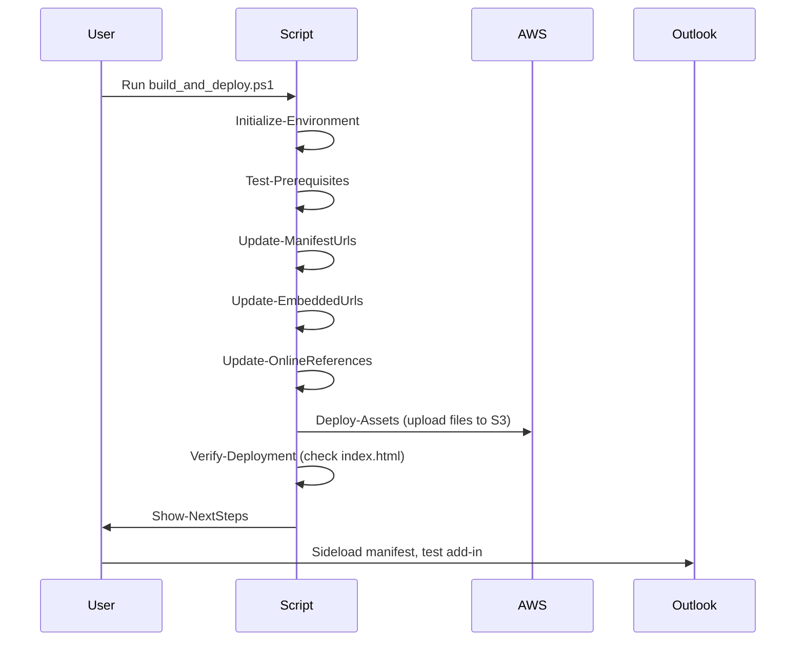

```mermaid
sequenceDiagram
    participant User
    participant Script
    participant AWS
    participant Outlook

    User->>Script: Run build_and_deploy.ps1
    Script->>Script: Initialize-Environment
    Script->>Script: Test-Prerequisites
    Script->>Script: Update-ManifestUrls
    Script->>Script: Update-EmbeddedUrls
    Script->>Script: Update-OnlineReferences
    Script->>AWS: Deploy-Assets (upload files to S3)
    Script->>Script: Verify-Deployment (check index.html)
    Script->>User: Show-NextSteps
    User->>Outlook: Sideload manifest, test add-in
```